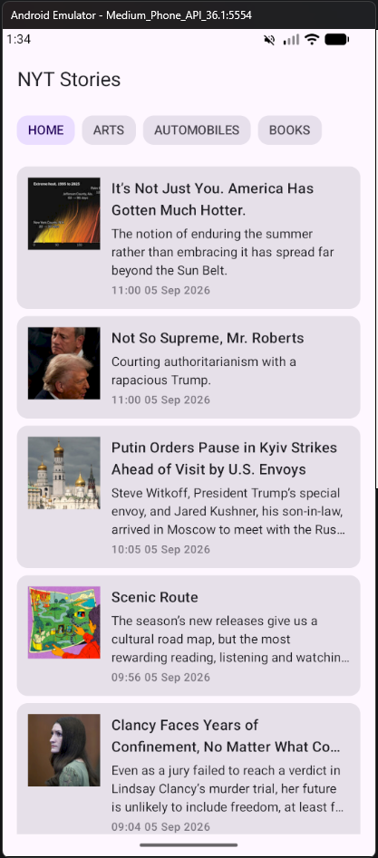
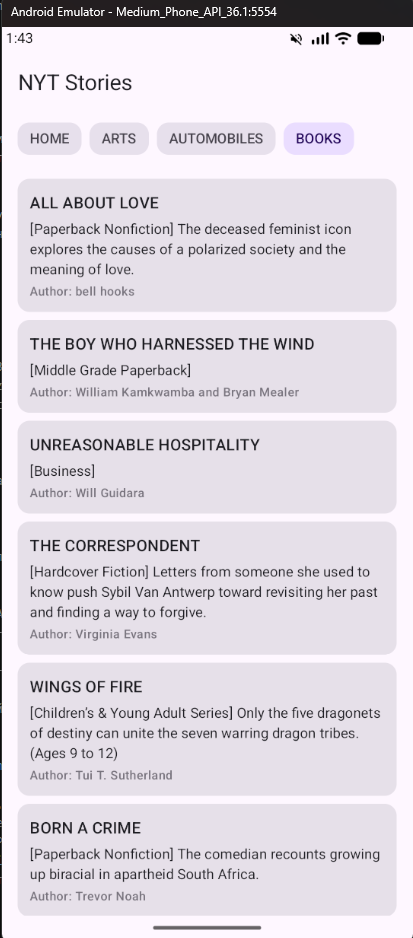

# NYT News

Кроссплатформенное приложение для чтения новостей The New York Times: один общий код и один общий интерфейс работают и на Android, и на iOS.


<!--
СКРИНШОТЫ: положите 3-4 файла в docs/screenshots/ и раскомментируйте блок ниже.
Нужны: лента новостей, переключение разделов, раздел Books, состояние загрузки/ошибки.

## Скриншоты

<p align="center">
  
  
  
</p>
-->

## Возможности

- Лента топ-новостей NYT с переключением между разделами — **Home**, **Arts**, **Automobiles**
- Раздел **Books** — сводка книжных бестселлеров по спискам NYT
- **Работает без интернета**: последние загруженные новости хранятся в локальной базе и открываются офлайн
- Pull-to-refresh для обновления ленты
- Изображения статей с асинхронной загрузкой и кэшированием
- Явные состояния экрана: загрузка, данные, ошибка

## Технологии

| Слой | Инструменты |
|---|---|
| Язык | Kotlin 2.3, Coroutines, Flow |
| UI | Compose Multiplatform, Material 3 |
| Сеть | Ktor Client 3, kotlinx.serialization |
| Хранилище | Room 2.8 (Kotlin Multiplatform) |
| DI | Koin 4 |
| Изображения | Coil 3 |
| Конфигурация | BuildKonfig |
| Сборка | Gradle Kotlin DSL, version catalog |

## Архитектура

Clean Architecture, разнесённая по отдельным Gradle-модулям:

```
        composeApp (Android)        iosApp (iOS)
                 └──────── shared ────────┘
                              │
        ┌─────────────────────┼─────────────────────┐
  shared:presentation    shared:domain         shared:data
     (ViewModel, UI)   (модели, интерфейсы)  (API, БД, репозиторий)
```

Зависимости направлены к домену: `presentation → domain ← data`.

- **`shared:domain`** — модели (`Story`, `Book`, `StoriesSection`) и интерфейс `StoriesRepository`. Чистый Kotlin: ничего не знает ни про Ktor, ни про Room, ни про Compose.
- **`shared:data`** — Ktor-клиент NYT API, DTO с мапперами в доменные модели, Room-база и реализация репозитория.
- **`shared:presentation`** — `StoriesViewModel`, состояние экрана и Compose-экраны. Переиспользуется обеими платформами целиком.
- **`composeApp` / `iosApp`** — тонкие точки входа под платформу.

## Как это устроено

### База данных — единственный источник правды

Экран подписан не на ответ сети, а на `Flow` из Room. Сеть только пополняет базу:

```kotlin
override fun getStories(section: StoriesSection): Flow<List<Story>> =
    dao.getAllAsFlowBySection(section.name).map { entities -> entities.map { it.toStory() } }

override suspend fun fetchStories(section: StoriesSection) {
    val stories = api.fetchStories(section.toStoriesSectionDto()).results.map { it.toStory() }
    dao.insert(stories.map { it.toEntity(section) })   // DAO сам эмитит новый список в UI
}
```

Что это даёт на практике:

- приложение открывается с новостями сразу, ещё до ответа сервера, и работает без интернета;
- ошибка сети не стирает то, что уже показано пользователю — она превращается в состояние ошибки только когда показывать нечего;
- у UI один вход для данных, а не два конкурирующих.

### Ключ API не лежит в репозитории

Ключ берётся из `local.properties` (файл в `.gitignore`) и подставляется в код на этапе сборки через BuildKonfig — в исходниках остаётся только `NytConfig.API_KEY`.

## Сборка и запуск

Нужен бесплатный ключ [NYT Developer API](https://developer.nytimes.com/).

1. Создайте в корне проекта файл `local.properties` и добавьте строку:

   ```properties
   nyt.api.key=ВАШ_КЛЮЧ
   ```

2. Соберите приложение:

   ```shell
   ./gradlew :composeApp:assembleDebug      # macOS / Linux
   .\gradlew.bat :composeApp:assembleDebug  # Windows
   ```

Для iOS откройте каталог [`iosApp`](./iosApp) в Xcode и запустите на симуляторе.

Требования: Android 7.0+ (minSdk 24), JDK 17+.

## Статус платформ

| | Android | iOS |
|---|---|---|
| Общий UI и логика | готово | готово |
| Сеть (Ktor) | движок `ktor-client-android` | движок `ktor-client-darwin` |
| Локальная база (Room) | готово | готово |

## Планы

- Экран отдельной статьи с переходом на оригинал
- Избранное с офлайн-доступом
- Юнит-тесты мапперов и `StoriesViewModel`
