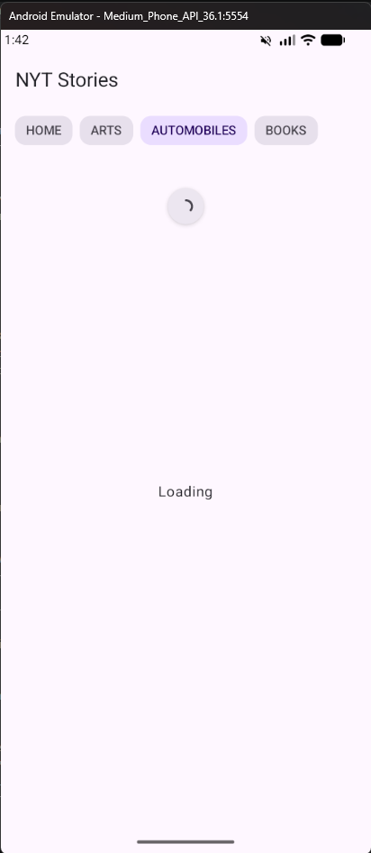
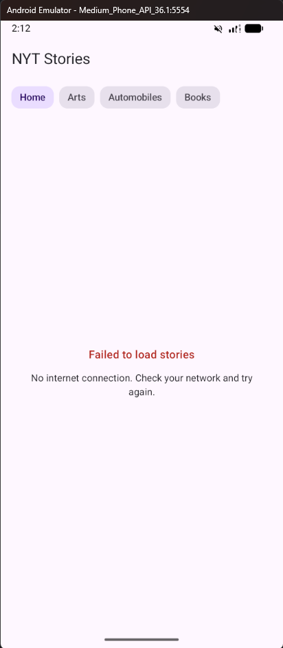

# NYT News

Кроссплатформенное приложение для чтения новостей The New York Times: один общий код и один общий интерфейс работают и на Android, и на iOS.


| Лента | Книги | Загрузка | Ошибка |
|---|---|---|---|
|  |  |  |  |

## Возможности

- Лента топ-новостей NYT с переключением между разделами — **Home**, **Arts**, **Automobiles**, **Books**
- Раздел **Books** — сводка книжных бестселлеров по спискам NYT в той же ленте
- **Работает без интернета**: последние загруженные новости хранятся в локальной базе и открываются офлайн
- Pull-to-refresh для обновления ленты
- Изображения статей с асинхронной загрузкой и кэшированием
- Явные состояния экрана: загрузка, данные, ошибка
- **Понятные ошибки**: 11 различимых причин отказа вместо «что-то пошло не так»
- Интерфейс на английском и русском — язык подхватывается из системных настроек

## Технологии

| Слой | Инструменты |
|---|---|
| Язык | Kotlin 2.3.0, Coroutines 1.10.2, Flow |
| UI | Compose Multiplatform 1.10.0, Material 3 (1.10.0-alpha05) |
| Сеть | Ktor Client 3.4.0, kotlinx.serialization 1.10.0 |
| Хранилище | Room 2.8.4 (KMP) + SQLite Bundled 2.6.2, KSP |
| DI | Koin 4.2.0-RC1 (BOM, `koin-compose-viewmodel`) |
| Изображения | Coil 3.4.0 (`coil-network-ktor3`) |
| Даты | kotlinx-datetime 0.6.0 |
| Локализация | Compose Resources (`values`, `values-ru`) |
| Конфигурация | BuildKonfig 0.15.1 |
| Тесты | kotlin.test, kotlinx-coroutines-test, Ktor MockEngine |
| Сборка | Gradle 8.14.3 (Kotlin DSL), AGP 8.13.2, version catalog |

Платформенные цели: `androidTarget` (compileSdk/targetSdk 36, minSdk 24, JVM 11), `iosArm64` и `iosSimulatorArm64` — общий код собирается в статический фреймворк `NytNews`.

## Архитектура

Clean Architecture, разнесённая по отдельным Gradle-модулям:

```
        composeApp (Android)        iosApp (iOS)
                 └──────── shared ────────┘
                              │
        ┌─────────────────────┼─────────────────────┐
  shared:presentation    shared:domain         shared:data
     (ViewModel, UI)   (модели, интерфейсы)  (API, БД, репозиторий)
```

Зависимости направлены к домену: `presentation → domain ← data`.

- **`shared:domain`** — модели (`Story`, `Book`, `StoriesSection`, `StoriesError`) и интерфейс `StoriesRepository`. Чистый Kotlin: ничего не знает ни про Ktor, ни про Room, ни про Compose.
- **`shared:data`** — Ktor-клиент NYT API, DTO с мапперами в доменные модели, Room-база и реализация репозитория.
- **`shared:presentation`** — `StoriesViewModel`, состояние экрана, строковые ресурсы и Compose-экраны. Переиспользуется обеими платформами целиком.
- **`shared`** — сборочный модуль: тема, `RootScreen` и общий Koin-модуль.
- **`composeApp` / `iosApp`** — тонкие точки входа под платформу.

## Как это устроено

### База данных — единственный источник правды

Экран подписан не на ответ сети, а на `Flow` из Room. Сеть только пополняет базу:

```kotlin
override fun getStories(section: StoriesSection): Flow<List<Story>> =
    dao.getAllAsFlowBySection(section.name).map { entities -> entities.map { it.toStory() } }

override suspend fun fetchStories(section: StoriesSection) {
    val stories = api.fetchStories(section.toStoriesSectionDto()).results.map { it.toStory() }
    dao.insert(stories.map { it.toEntity(section) })   // DAO сам эмитит новый список в UI
}
```

Что это даёт на практике:

- приложение открывается с новостями сразу, ещё до ответа сервера, и работает без интернета;
- ошибка сети не стирает то, что уже показано пользователю — она превращается в состояние ошибки только когда показывать нечего;
- у UI один вход для данных, а не два конкурирующих.

URL статьи служит первичным ключом (`OnConflictStrategy.REPLACE`), поэтому повторное обновление раздела не плодит дубликатов.

### Ошибка объясняет себя

Любое исключение по пути «сеть → база → экран» сводится к одному из значений `StoriesError`: `NO_INTERNET`, `TIMEOUT`, `API_KEY_MISSING`, `UNAUTHORIZED`, `RATE_LIMITED`, `NOT_FOUND`, `SERVER`, `BAD_RESPONSE`, `STORAGE`, `NO_DATA`, `UNKNOWN`. Каждому соответствует свой текст в `strings.xml` — на английском и русском.

`StoriesViewModel` собирает состояние в одном месте и расставляет приоритеты: загруженные новости важнее ошибки, а отказ базы важнее сетевого — экран читает данные только из неё, поэтому удачный запрос в сеть ничего не чинит, пока база недоступна.

### Ключ API не лежит в репозитории

Ключ берётся из `local.properties` (файл в `.gitignore`) и подставляется в код на этапе сборки через BuildKonfig — в исходниках остаётся только `NytConfig.API_KEY`. Если ключ не задан, запрос даже не уходит: репозиторий сразу возвращает `API_KEY_MISSING`, и экран объясняет, что именно нужно добавить.

## Тесты

34 юнит-теста на общем коде: маппер исключений в `StoriesError`, репозиторий (на Ktor `MockEngine`), машина состояний `StoriesViewModel` и форматирование дат.

```shell
./gradlew :shared:data:testAndroidHostTest :shared:presentation:testAndroidHostTest
```

На macOS те же тесты гоняются и на Kotlin/Native — `./gradlew allTests`.

## Сборка и запуск

Нужен бесплатный ключ [NYT Developer API](https://developer.nytimes.com/).

1. Создайте в корне проекта файл `local.properties` и добавьте строку:

   ```properties
   nyt.api.key=ВАШ_КЛЮЧ
   ```

2. Соберите приложение:

   ```shell
   ./gradlew :composeApp:assembleDebug      # macOS / Linux
   .\gradlew.bat :composeApp:assembleDebug  # Windows
   ```

Для iOS откройте каталог [`iosApp`](./iosApp) в Xcode и запустите на симуляторе (Apple Silicon: цель `iosSimulatorArm64`).

Требования: Android 7.0+ (minSdk 24), JDK 17–24 (плагины Room и AGP требуют минимум 17, Gradle 8.14.3 ещё не поддерживает JDK 25).

## Статус платформ

| | Android | iOS |
|---|---|---|
| Общий UI и логика | готово | готово |
| Сеть (Ktor) | движок `ktor-client-android` | движок `ktor-client-darwin` |
| Локальная база (Room) | готово | готово |

## Планы

- Экран отдельной статьи с переходом на оригинал
- Избранное с офлайн-доступом
- Тёмная тема и динамические цвета
